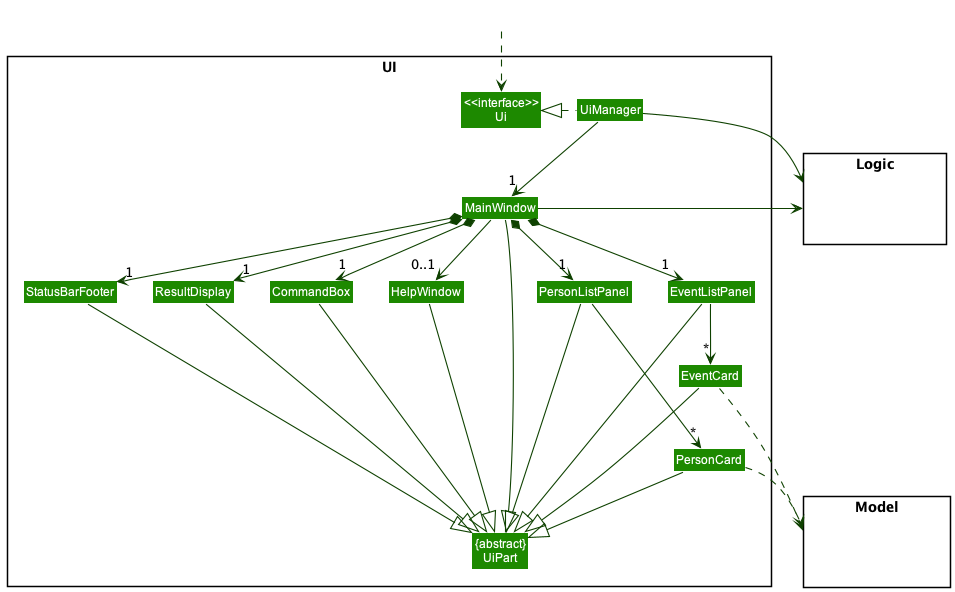
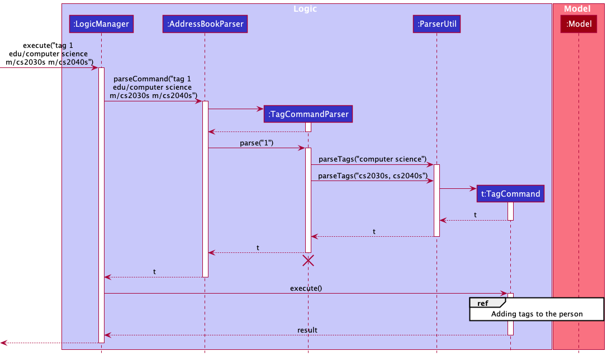
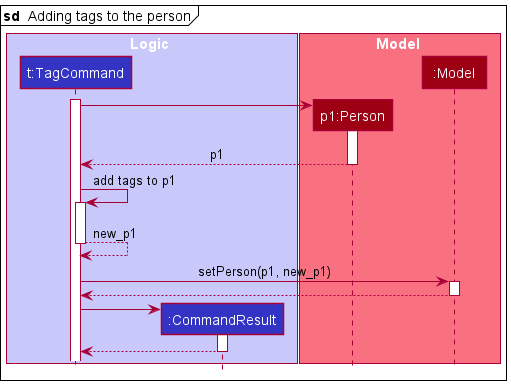
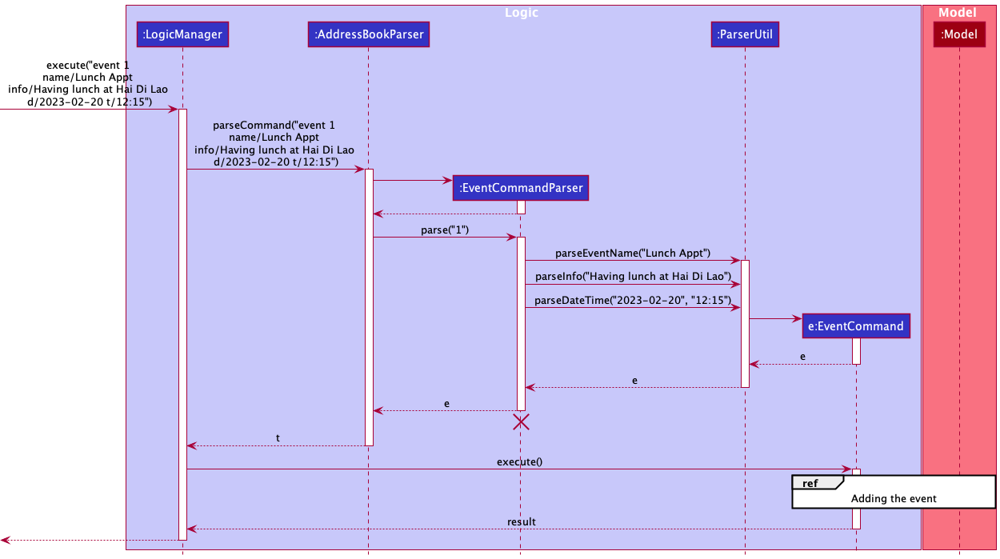
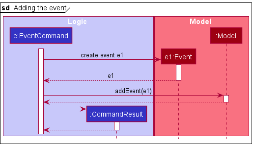
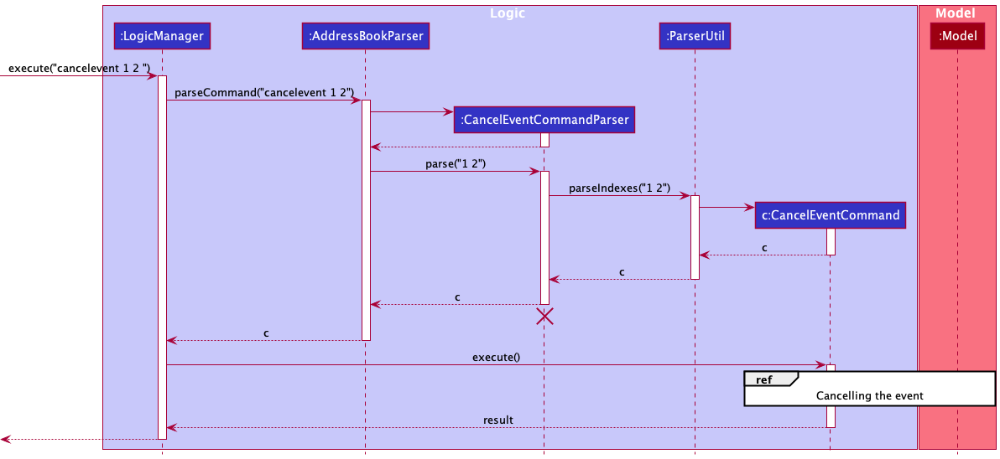
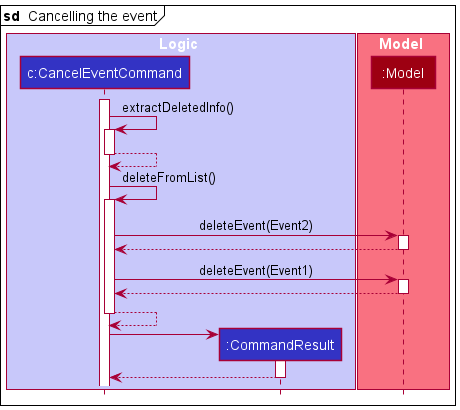

* Table of Contents
{:toc}

--------------------------------------------------------------------------------------------------------------------

## **Acknowledgements**

1. Referred to [CS2103T textbook](https://nus-cs2103-ay2122s2.github.io/website/se-book-adapted/index.html) for fundamental knowledge on software development.
2. This product is based on the AddressBook-Level3 project created by [SE-EDU initiative](https://se-education.org/)
3. Libraries used: [JavaFx](https://openjfx.io/), [JUnit5](https://github.com/junit-team/junit5), [Jackson](https://github.com/FasterXML/jackson)

--------------------------------------------------------------------------------------------------------------------

## **Setting up, getting started**

Refer to the guide [_Setting up and getting started_](SettingUp.md).

--------------------------------------------------------------------------------------------------------------------

## **Design**

<div markdown="span" class="alert alert-primary">

:bulb: **Tip:** The `.puml` files used to create diagrams in this document can be found in the [diagrams](https://github.com/se-edu/addressbook-level3/tree/master/docs/diagrams/) folder. Refer to the [_PlantUML Tutorial_ at se-edu/guides](https://se-education.org/guides/tutorials/plantUml.html) to learn how to create and edit diagrams.
</div>

### Architecture


The ***Architecture Diagram*** given above explains the high-level design of the App.

Given below is a quick overview of main components and how they interact with each other.

**Main components of the architecture**

**`Main`** has two classes called [`Main`](https://github.com/AY2122S2-CS2103T-W11-1/tp/blob/master/src/main/java/seedu/address/Main.java) and [`MainApp`](https://github.com/AY2122S2-CS2103T-W11-1/tp/blob/master/src/main/java/seedu/address/MainApp.java). It is responsible for,
* At app launch: Initializes the components in the correct sequence, and connects them up with each other.
* At shut down: Shuts down the components and invokes cleanup methods where necessary.

[**`Commons`**](#common-classes) represents a collection of classes used by multiple other components.

The rest of the App consists of four components.

* [**`UI`**](#ui-component): The UI of the App.
* [**`Logic`**](#logic-component): The command executor.
* [**`Model`**](#model-component): Holds the data of the App in memory.
* [**`Storage`**](#storage-component): Reads data from, and writes data to, the hard disk.


**How the architecture components interact with each other**

The *Sequence Diagram* below shows how the components interact with each other for the scenario where the user issues the command `delete 1`.


Each of the four main components (also shown in the diagram above),

* defines its *API* in an `interface` with the same name as the Component.
* implements its functionality using a concrete `{Component Name}Manager` class (which follows the corresponding API `interface` mentioned in the previous point.

For example, the `Logic` component defines its API in the `Logic.java` interface and implements its functionality using the `LogicManager.java` class which follows the `Logic` interface. Other components interact with a given component through its interface rather than the concrete class (reason: to prevent outside component's being coupled to the implementation of a component), as illustrated in the (partial) class diagram below.


The sections below give more details of each component.

### UI component

The **API** of this component is specified in [`Ui.java`](https://github.com/AY2122S2-CS2103T-W11-1/tp/blob/master/src/main/java/seedu/address/ui/Ui.java)



The UI consists of a `MainWindow` that is made up of parts e.g.`CommandBox`, `ResultDisplay`, `PersonListPanel`, `StatusBarFooter` etc. All these, including the `MainWindow`, inherit from the abstract `UiPart` class which captures the commonalities between classes that represent parts of the visible GUI.

The `UI` component uses the JavaFx UI framework. The layout of these UI parts are defined in matching `.fxml` files that are in the `src/main/resources/view` folder. For example, the layout of the [`MainWindow`](https://github.com/se-edu/addressbook-level3/tree/master/src/main/java/seedu/address/ui/MainWindow.java) is specified in [`MainWindow.fxml`](https://github.com/se-edu/addressbook-level3/tree/master/src/main/resources/view/MainWindow.fxml)

The `UI` component,

* executes user commands using the `Logic` component.
* listens for changes to `Model` data so that the UI can be updated with the modified data.
* keeps a reference to the `Logic` component, because the `UI` relies on the `Logic` to execute commands.
* depends on some classes in the `Model` component, as it displays `Person` object residing in the `Model`.

### Logic component

**API** : [`Logic.java`](https://github.com/AY2122S2-CS2103T-W11-1/tp/blob/master/src/main/java/seedu/address/logic/Logic.java)

Here's a (partial) class diagram of the `Logic` component:


How the `Logic` component works:
1. When `Logic` is called upon to execute a command, it uses the `AddressBookParser` class to parse the user command.
1. This results in a `Command` object (more precisely, an object of one of its subclasses e.g., `AddCommand`) which is executed by the `LogicManager`.
1. The command can communicate with the `Model` when it is executed (e.g. to add a person).
1. The result of the command execution is encapsulated as a `CommandResult` object which is returned back from `Logic`.

The Sequence Diagram below illustrates the interactions within the `Logic` component for the `execute("delete 1")` API call.


<div markdown="span" class="alert alert-info">:information_source: **Note:** The lifeline for `DeleteCommandParser` should end at the destroy marker (X) but due to a limitation of PlantUML, the lifeline reaches the end of diagram.
</div>

Here are the other classes in `Logic` (omitted from the class diagram above) that are used for parsing a user command:


How the parsing works:
* When called upon to parse a user command, the `AddressBookParser` class creates an `XYZCommandParser` (`XYZ` is a placeholder for the specific command name e.g., `AddCommandParser`) which uses the other classes shown above to parse the user command and create a `XYZCommand` object (e.g., `AddCommand`) which the `AddressBookParser` returns back as a `Command` object.
* All `XYZCommandParser` classes (e.g., `AddCommandParser`, `DeleteCommandParser`, ...) inherit from the `Parser` interface so that they can be treated similarly where possible e.g, during testing.

### Model component
**API** : [`Model.java`](https://github.com/AY2122S2-CS2103T-W11-1/tp/blob/master/src/main/java/seedu/address/model/Model.java)


The `Model` component,

* stores the address book data i.e., all `Person` objects (which are contained in a `UniquePersonList` object) and all `Event` objects (whihc are contained in a `UniqueEventList` object).
* stores the currently 'selected' `Person` objects (e.g., results of a search query) as a separate _filtered_ list which is exposed to outsiders as an unmodifiable `ObservableList<Person>` that can be 'observed' e.g. the UI can be bound to this list so that the UI automatically updates when the data in the list change.
* stores the currently 'selected' `Event` objects (e.g., results of a search query) as a separate _filtered_ list which is exposed to outsiders as an unmodifiable `ObservableList<Event>` that can be 'observed' e.g. the UI can be bound to this list so that the UI automatically updates when the data in the list change.
* stores a `UserPref` object that represents the user’s preferences. This is exposed to the outside as a `ReadOnlyUserPref` objects.
* does not depend on any of the other three components (as the `Model` represents data entities of the domain, they should make sense on their own without depending on other components)

<div markdown="span" class="alert alert-info">:information_source: **Note:** The alternative (arguably, a more OOP) models are given below for `Person` and `Event` separately. The `Person` model has a `Tag` list in the `AddressBook`, which `Person` references. This allows `AddressBook` to only require one `Tag` object per unique tag, instead of each `Person` needing their own `Tag` objects.<br>


</div>


### Storage component

**API** : [`Storage.java`](https://github.com/AY2122S2-CS2103T-W11-1/tp/blob/master/src/main/java/seedu/address/storage/Storage.java)


The `Storage` component,
* can save both address book data and user preference data in json format, and read them back into corresponding objects.
* inherits from both `AddressBookStorage` and `UserPrefStorage`, which means it can be treated as either one (if only the functionality of only one is needed).
* depends on some classes in the `Model` component (because the `Storage` component's job is to save/retrieve objects that belong to the `Model`)

### Common classes

Classes used by multiple components are in the `seedu.addressbook.commons` package.

--------------------------------------------------------------------------------------------------------------------

## **Implementation**

This section describes some noteworthy details on how certain features are implemented.

### Delete multiple persons enhancement

#### Original Implementation
Originally, the idea was to simply call `deletePerson` on each integer, but this will not work as the indexes of each person
in the contact list might change depending on the order of deletion. <br>

**For example:** <br>
In a list with only 3 contacts, `delete 1 2 3` will not be allowed as there is no longer an index 3 during the 3rd deletion.

#### Current Implementation

The delete command now has to accept multiple indexes as a valid input. The ParserUtil class can easily facilitate this
behaviour by extending the validity checks on the entire string of input.

The workaround is then to delete each person from the largest to the smallest index. The success message displays the details
of those deleted, so in order to show them in the same order as the input, all the details are first extracted out before deletion.<br>

**For example:** <br>
Similarly, in a list with only 3 contacts, `delete 1 2 3` will now be allowed.

**Step 1.** User enters `delete 1 2 3` and `LogicManager` would execute it.

**Step 2.** `LogicManager` would pass the arguments to `AddressBookParser` to parse the command as a `DeleteCommand`.

**Step 3.** The arguments `1 2 3` would be passed into `DeleteCommandParser` to detect if the deletion is for multiple persons using `ParserUtil`.

**Step 4.** Information about Person 1, Person 2 and Person 3 will be extracted according to the last shown list.<br>

**Step 5.** The deletion process starts sequentially. Person 3 gets deleted followed by Person 2, then Person 1. This ensures correctness in the deletion process.


The Sequence Diagram below illustrates the interactions within the Logic component for the `execute("delete 1 2 3")` API call.


### Tag feature

#### Current Implementation
The current tagging feature is originally a functionality in the `Add` command. However, it was extracted out and made
into its own command in order to help facilitate a clearer distinction between those features. The `Tag` command would
allow users to tag additional information to existing persons in the address book.

With this new introduction of the Tag Command, it led to the creation of the abstract class `Tag`. The idea was to only
allow subclasses of `Tag` to be tagged to a person. Currently, there are 4 of such subclasses that extends from `Tag`:
* `Cca` - stores information about the person's cca
* `Education` - stores information about the person's degree course
* `Module` - stores information about the person's module
* `Internship` - stores information about the person's internship


Below is an example usage scenario and how the tagging mechanism behaves at each step:

**Step 1.** The user enters the following valid `TagCommand`: `tag 1 edu/computer science m/cs2030s m/cs2040s` and `LogicManager`
would execute it.

**Step 2.** `LogicManger` would pass the argument to `AddressBookParser` to parse the command and identify it as a `TagCommand`.
It will then pass the arguments to `TagCommandParser` to handle the parsing for the identified `TagCommand`.

**Step 3.** `TagCommandParser` would first parse the index using `ParserUtil#parseIndex()` to identify the person to tag to.
Afterwards, `TagCommandParser` would parse the tag arguments provided using `ParserUtil#parseTags()` to identify the individual
tag types for the arguments provided.

**Step 4.** After parsing the arguments, the control is handed over to `TagCommand` where it will return a `TagCommand` object. It
will eventually return to `LogicManager` which will call `TagCommand#execute()` to execute the command.

**Step 5.** Upon execution, the person will be fetched and tagged using `Model#setPerson`. The edited person would then be updated
and stored in the addressbook. `CommandResult` would then generate a success message to inform the user the person has been tagged
successfully.

The following sequence diagram shows how the tag operation works:



### Remove Tag feature

#### Current implementation
The `removetag` command creates and copies the target `Person` into a new `Person` object, except all tags are stored in hashsets instead. <br>
Hashsets allow the application to perform fast searches and checks, such as checking if all provided tags are existing tags in the target `Person` and to utilize the `removeAll()` function.
`removetag` will not allow user to remove a non-existent tag.

Given below is an example scenario of how the `removetag` command works.

**Step 1:** User inputs the following valid `removetag` command: `removetag 2 m/cs2107 m/cs2100`.

**Step 2:** The second person on the contact list happens to be David, and he has 4 tags. Below is an object diagram of David during the command execution, before any removal of tags.


**Step 3:** After checking that David indeed has the module tags `cs2107` and `cs2100` given by the command input, the command will execute the removal of tags.

**Step 4:** The removal of tags is successful, and a success message will be generated.


The following sequence diagrams shows how the `removetag` operation works: <br>


### Event feature

#### Current Implementation
The event command allows the user to create an event which will be stored in the address book. Each `Event` has the following
fields:
* `EventName` - the name of the event
* `Information`- additional details about the event
* `Participants` - the persons participating in this event
* `DateTime` - the date and time of the event

For each `Event`, the user is able to indicate which of the following persons will be tagged to the event being created. Hence,
`Delete` and `Edit` have dependencies on `Event` where changes in the participants' names would have to be changed and reflected
accordingly for the respective events that are affected.

Below is an example usage scenario and how the event mechanism behaves at each step:

**Step 1.** The user enters the valid `EventCommand` : `event 1 name/Lunch Appt info/Having lunch at Hai Di Lao d/2023-02-20 t/12:15` and
`LogicManager` would execute it.

**Step 2.** `LogicManger` would pass the argument to `AddressBookParser` to parse the command and identify it as an `EventCommand`.
It will then pass the arguments to `EventCommandParser` to handle the parsing for the identified `EventCommand`.

**Step 3.** `EventCommandParser` would first parse the index using `ParserUtil#parseIndex()` to identify the person to tag to the event.
Afterwards, `EventCommandParser` would parse the event arguments provided using `ParserUtil#parseEventName()` to identify the event name,
`ParserUtil#parseInfo()` to identify the event details and `ParserUtil#parseDateTime()` to identify the event date and time.

**Step 4.** After parsing the arguments, the control is handed over to `EventCommand` where it will return an `EventCommand` object. It
will eventually return to `LogicManager` which will call `EventCommand#execute()` to execute the command.

**Step 5.** Upon execution, the event will be created and added into the `AddressBook` using `Model#addEvent`.
`CommandResult` would then generate a success message to inform the user the event has been added successfully.

The following sequence diagram shows how the tag operation works:



### Cancel Event feature

#### Current Implementation
The cancel event command would allow the user to cancel and remove an event from the address book. The index specified by the user would
lead to the deletion of the corresponding event in the event list, as long as it is a valid index. The user also has the option of specifying
multiple indexes if multiple deletions are required.

Below is an example usage scenario and how the tagging mechanism behaves at each step:

**Step 1.** The user enters the valid `CancelEventCommand` : `cancelevent 1 2` and `LogicManager` would execute it.

**Step 2.** `LogicManger` would pass the argument to `AddressBookParser` to parse the command and identify it as an `CancelEventCommand`.
It will then pass the arguments to `CancelEventCommandParser` to handle the parsing for the identified `CancelEventCommand`.

**Step 3.** `CancelEventCommandParser` would first parse the string of indexes using `ParserUtil#parseIndexes()` to identify the events
and ensure the indexes are unique and positive integers.

**Step 4.** After parsing the arguments, the control is handed over to `CancelEventCommand` where it will return a `CancelEventCommand` object. It
will eventually return to `LogicManager` which will call `CancelEventCommand#execute()` to execute the command.

**Step 5.** Upon execution, the information of the events will be extracted using `CancelEventCommand#extractDeletedInfo()` that will be use as output for the
notifying the user later. Afterwards, the events will be deleted from the `AddressBook` using `Model#deleteEvent` within `CancelEventCommand#deleteFromList`.
Finally, `CommandResult` would then generate a success message to inform the user the event has been added successfully.

The following sequence diagram shows how the tag operation works:



### Edit Feature

#### Original Implementation
The edit command uses an `EditPersonDescriptor` to store the new information that is to be changed in the person. The
`EditCommandParser` parses the information input and then creates an `EditPersonDescriptor` where the unchanged fields
are copied over from the existing person and the fields to be overwritten are changed. The Find command then takes in
the descriptor and simply changes the persons attribute values to the values stated in the descriptor.

#### Current Implementation
The edit command has now been upgraded to support the functionality for multiple tags. Existing tags of a person will not be affected.


### Find feature

#### Original Implementation
The existing Find feature in AB3 only allowed contacts to be searched for by name. We added additional functionalities
to allow for greater flexibility when filtering large contacts lists according to specific predicates. The `Find` and
`Find -s` command now allow the user to search for specific contact details (name, phone number, email and address) or
specific tags.

#### Current Implementation
The `Find` command searches for contacts that satisfy any of the given predicates while the `Find -s` command searches
for contacts that satisfy all the given predicates. Do note that the conjunction and disjunction also applies within
each tag field (see User Guide for more details).

### \[Proposed\] Undo/redo feature

#### Proposed Implementation

The proposed undo/redo mechanism is facilitated by `VersionedAddressBook`. It extends `AddressBook` with an undo/redo history, stored internally as an `addressBookStateList` and `currentStatePointer`. Additionally, it implements the following operations:

* `VersionedAddressBook#commit()` — Saves the current address book state in its history.
* `VersionedAddressBook#undo()` — Restores the previous address book state from its history.
* `VersionedAddressBook#redo()` — Restores a previously undone address book state from its history.

These operations are exposed in the `Model` interface as `Model#commitAddressBook()`, `Model#undoAddressBook()` and `Model#redoAddressBook()` respectively.

Given below is an example usage scenario and how the undo/redo mechanism behaves at each step.

**Step 1.** The user launches the application for the first time. The `VersionedAddressBook` will be initialized with the initial address book state, and the `currentStatePointer` pointing to that single address book state.


**Step 2.** The user executes `delete 5` command to delete the 5th person in the address book. The `delete` command calls `Model#commitAddressBook()`, causing the modified state of the address book after the `delete 5` command executes to be saved in the `addressBookStateList`, and the `currentStatePointer` is shifted to the newly inserted address book state.


**Step 3.** The user executes `add n/David …​` to add a new person. The `add` command also calls `Model#commitAddressBook()`, causing another modified address book state to be saved into the `addressBookStateList`.


<div markdown="span" class="alert alert-info">:information_source: **Note:** If a command fails its execution, it will not call `Model#commitAddressBook()`, so the address book state will not be saved into the `addressBookStateList`.

</div>

**Step 4.** The user now decides that adding the person was a mistake, and decides to undo that action by executing the `undo` command. The `undo` command will call `Model#undoAddressBook()`, which will shift the `currentStatePointer` once to the left, pointing it to the previous address book state, and restores the address book to that state.


<div markdown="span" class="alert alert-info">:information_source: **Note:** If the `currentStatePointer` is at index 0, pointing to the initial AddressBook state, then there are no previous AddressBook states to restore. The `undo` command uses `Model#canUndoAddressBook()` to check if this is the case. If so, it will return an error to the user rather
than attempting to perform the undo.

</div>

The following sequence diagram shows how the undo operation works:


<div markdown="span" class="alert alert-info">:information_source: **Note:** The lifeline for `UndoCommand` should end at the destroy marker (X) but due to a limitation of PlantUML, the lifeline reaches the end of diagram.

</div>

The `redo` command does the opposite — it calls `Model#redoAddressBook()`, which shifts the `currentStatePointer` once to the right, pointing to the previously undone state, and restores the address book to that state.

<div markdown="span" class="alert alert-info">:information_source: **Note:** If the `currentStatePointer` is at index `addressBookStateList.size() - 1`, pointing to the latest address book state, then there are no undone AddressBook states to restore. The `redo` command uses `Model#canRedoAddressBook()` to check if this is the case. If so, it will return an error to the user rather than attempting to perform the redo.

</div>

**Step 5.** The user then decides to execute the command `list`. Commands that do not modify the address book, such as `list`, will usually not call `Model#commitAddressBook()`, `Model#undoAddressBook()` or `Model#redoAddressBook()`. Thus, the `addressBookStateList` remains unchanged.


**Step 6.** The user executes `clear`, which calls `Model#commitAddressBook()`. Since the `currentStatePointer` is not pointing at the end of the `addressBookStateList`, all address book states after the `currentStatePointer` will be purged. Reason: It no longer makes sense to redo the `add n/David …​` command. This is the behavior that most modern desktop applications follow.


The following activity diagram summarizes what happens when a user executes a new command:


#### Design considerations:

**Aspect: How undo & redo executes:**

* **Alternative 1 (current choice):** Saves the entire address book.
    * Pros: Easy to implement.
    * Cons: May have performance issues in terms of memory usage.

* **Alternative 2:** Individual command knows how to undo/redo by
  itself.
    * Pros: Will use less memory (e.g. for `delete`, just save the person being deleted).
    * Cons: We must ensure that the implementation of each individual command are correct.

_{more aspects and alternatives to be added}_


--------------------------------------------------------------------------------------------------------------------

## **Documentation, logging, testing, configuration, dev-ops**

* [Documentation guide](Documentation.md)
* [Testing guide](Testing.md)
* [Logging guide](Logging.md)
* [Configuration guide](Configuration.md)
* [DevOps guide](DevOps.md)

--------------------------------------------------------------------------------------------------------------------

## **Appendix: Requirements**

### Product scope

**Target user profile**:

* university students who like to maintain a professional contact list
* prefer desktop apps over other types
* can type fast
* prefers typing to mouse interactions
* is reasonably comfortable using CLI apps

**Value proposition**: to facilitate a convenient way for university students to manage their professional networks with fellow acquaintances


### User stories

Priorities: 
* `* * *` - High (must have)
* `* *` - Medium (nice to have)
* `*` - Low (unlikely to have)

| Priority | As a …​                                                  | I want to …​                                             | So that I can…​                                                                                   |
|----------|----------------------------------------------------------|----------------------------------------------------------|---------------------------------------------------------------------------------------------------|
| `* * *`  | new user                                                 | see usage instructions                                   | refer to instructions when I forget how to use the App                                            |
| `* * *`  | user                                                     | view all of my contacts                                  |                                                                                                   |
| `* * *`  | user                                                     | add a new contact                                        |
| `* * *`  | user                                                     | delete a contact                                         | remove entries that I no longer need                                                              |
| `* * *`  | user                                                     | delete multiple contacts at once                         | delete unwanted entries faster                                                                    |
| `* * *`  | user                                                     | edit an existing contact                                 | update the information when needed                                                                |
| `* * *`  | user                                                     | tag additional information to an existing contact        | keep a memo of such details for future references                                                 |
| `* * `   | user                                                     | add an event and tag relevant persons in my contact list | keep a memo of such upcoming events with my contacts for future references                        |
| `* * `   | user                                                     | view all of my upcoming events                           |                                                                                                   |
| `* * `   | user                                                     | view all of my past events                               |                                                                                                   |
| `* * `   | user                                                     | view all of my past and upcoming events                  |                                                                                                   |
| `* * `   | user                                                     | cancel an event                                          |                                                                                                   |
| `* * `   | user                                                     | cancel multiple events at once                           | cancel unnecessary events faster                                                                  |
| `* * `   | user                                                     | find a person by name                                    | locate details of persons without having to go through the entire list                            |
| `* * `   | user                                                     | find a person by phone number                            | locate details of persons without having to go through the entire list                            |
| `* * `   | user                                                     | find a person by email address                           | locate details of persons without having to go through the entire list                            |
| `* * `   | user                                                     | find a person by module                                  | locate details of persons with identical modules, without having to go through the entire list    |
| `* * `   | user                                                     | find a person by internship                              | locate details of persons with identical internship, without having to go through the entire list |
| `* * `   | user                                                     | find a person by cca                                     | locate details of persons with identical cca, without having to go through the entire list        |
| `* * `   | user                                                     | find a person by education                               | locate details of persons with identical education, without having to go through the entire list  |
| `* *`    | user with too many irrelevant persons in the contact list | delete all my contacts                                   | reset my contact list                                                                             |
| `*`      | user that tagged a lot of information to the contacts    | remove a specific tag of a contact                       | avoid going through the trouble of re-tagging all the information again                           |
| `*`      | user with many persons in the contact list               | sort persons by name in alphabetical order               | locate a person easily                                                                            |


### Use cases

(For all use cases below, the **System** is the `NUSocials` and the **Actor** is the `user`, unless specified otherwise)

### Use case 1: Delete a person

**MSS**
````
1.  User requests to list persons.
2.  NUSocials shows a list of persons.
3.  User requests to delete a specific person in the list.
4.  NUSocials deletes the person from its addressbook.

    Use case ends.
````
**Extensions**
````
2a. The list is empty.

    Use case ends.

3a. The given index is invalid.

    - 3a1. NUSocials shows an error message.

      Use case resumes at step 2.
````

### Use case 2: Add a person

**MSS**
````
1. User adds a new person in the given command format (see User Guide).
2. NUSocials adds the new person to the addressbook.

    Use case ends.
````
**Extensions**
````
2a. The given add command is invalid.

    - 2a1. NUSocials shows an error message.

      Use case resumes at step 1.
````

### Use case 3: Tag a person

**MSS**
````
1. User requests to list all persons.
2. NUSocials shows a list of all persons from its addressbook.
3. User inputs command to tag a specific person in the list.
4. NUSocials tags the person.

    Use case ends.
````
**Extensions**
````
2a. The list is empty.

    Use case ends

3a. The given index is invalid.

    - 3a1. NUSocials shows an error message.

      Use case resumes at step 2.

3b. The given tag command is invalid.

    - 3b1. NUSocials shows an error message.

      Use case resumes at step 2.
````
### Use case 4: Edit a person

**MSS**
````
1. User requests to list all persons.
2. NUSocials shows a list of all persons from its addressbook.
3. Users requests to overwrite certain fields of the person with updated information.
4. NUSocials tags the person.

    Use case ends.
````
**Extensions**
````
2a. The list is empty.

    Use case ends.

3a. The given index is invalid.

    - 3a1. NUSocials shows an error message.

      Use case resumes at step 2.

3b. The given edit command is invalid.

    - 3b1. NUSocials shows an error message.

      Use case resumes at step 2.
````
### Use case 5: Viewing all persons

**MSS**
````
1. User requests to list all persons.
2. NUSocials displays all persons in a list from its addressbook.

    Use case ends.
````

### Use case 6: Viewing events

**MSS**
````
1. User requests to list all events.
2. NUSocials displays all events in a list from its addressbook.

    Use case ends.
````
**Extensions**
````
1a. User specifies past or upcoming events.

    Use case resumes at step 2.

2a. NUSocials displays past or upcoming events instead.

    Use case ends.

2b. The given find command is invalid.

    - 2b1. NUSocials shows an error message.

      Use case resumes at step 1.
````

### Use case 7: Finding a person (any field)

**MSS**
````
1. User requests to find any person using specific fields.
2. NUSocials shows a list of persons matching any fields from its addressbook.

    Use case ends.
````
**Extensions**
````
2a. The given find command is invalid.

    - 2a1. NUSocials shows an error message.

      Use case resumes at step 1.
````
### Use case 8: Finding a person (all fields)

````
Similar to Use case 7, except now:
The user wants to find a person that has every field instead.
````

### Use case 9: Removing specific tags

**MSS**
````
1. User requests to list all persons.
2. NUSocials shows a list of all persons from its addressbook.
3. User requests to remove certain tags from the person.
4. NUSocials removes the specific tags from the person.

    Use case ends.
````
**Extensions**
````
2a. The list is empty.

  Use case ends.

3a. The given index is invalid.

    - 3a1. NUSocials shows an error message.

      Use case resumes at step 2.

3b. The given removetag command is invalid.

    - 3b1. NUSocials shows an error message.

      Use case resumes at step 2.

3c. The request contains non-existent tags to be removed.

    - 3c1. NUSocials shows an error message.

      Use case resumes at step 2.
````

### Use case 10: Delete multiple persons

**MSS**
````
Similar to Use case 1, except now:
The user wants to delete multiple persons instead.
````
**Extensions**
````
2a. The list is empty.

    Use case ends.

3a. One or more of given indexes are invalid.

    - 3a1. NUSocials shows an error message.

      Use case resumes at step 2.
````

### Use case 11: Adding an event

**MSS**
````
1. User adds a new event in the given command format (see User Guide).
2. NUSocials adds the new event to the addressbook.

    Use case ends.
````
**Extensions**
````
2a. The given event command is invalid.

    - 2a1. NUSocials shows an error message.

      Use case resumes at step 1.
````

### Use case 12: Cancelling events

**MSS**
````
Similar to Use case 10, except now:
The user wants to delete event(s) instead.
````
**Extensions**
````
2a. The list is empty.

  Use case ends.

3a. One or more of given indexes are invalid.

    - 3a1. NUSocials shows an error message.

      Use case resumes at step 2.
````

### Non-Functional Requirements

1. Should work on _mainstream OS_ as long as it has Java `11` or above installed.
2. Should be able to hold up to 1000 persons without a noticeable sluggishness in performance for typical usage.
3. A user with above average typing speed for regular English text (i.e not code, not system admin commands) should be able to accomplish most of the tasks faster using commands than using the mouse.
4. The system should work on both 32-bit and 64-bit environments.
5. The system should respond within 3 seconds.
6. The product is strictly an offline application and data is stored locally.
7. The product is not required to handle the feature of finding past events based on the date and time. 
(i.e using a past date & time for the "find -e" command would be invalid)
8. The product is not required to handle multiple whitespaces in between words for all data field inputs. 
(i.e "Alison Baker" will not be identified the same as "Alison   Baker")
9. The product is not required to handle the multiple events occurring at the same time.
(i.e Multiple events sharing the same date and time would be recognized as separate unique events respectively)
10. The product is not required to handle the visibility of long addresses in the person's contact card.
11. The system should be usable by a novice who has used CLI commands before.

### Glossary

* **Mainstream OS**: Windows, macOS
* **CLI**: Command Line Interface

--------------------------------------------------------------------------------------------------------------------

## **Appendix: Instructions for manual testing**

Given below are instructions to test the app manually.

<div markdown="span" class="alert alert-info">:information_source: **Note:** These instructions only provide a starting point for testers to work on;
testers are expected to do more *exploratory* testing.

</div>

### Launch and shutdown

1. Initial launch

    1. Download the jar file and copy into an empty folder

    1. Double-click the jar file<br>
        Expected: Shows the GUI with a set of sample contacts. The window size may not be optimum.

2. Saving window preferences

    1. Resize the window to an optimum size. Move the window to a different location. Close the window.

    1. Re-launch the app by double-clicking the jar file.<br>
       Expected: The most recent window size and location are retained.

3. Subsequent launch
    1. Make some changes to NUSocials and close the application.

    1. Reopen the application by double-clicking the jar file<br>
        Expected: Shows the GUI and loads contacts from NUSocials. Should reflect the changes made previously.

### Deleting person

1. Deleting a person while all persons are being shown

    1. Prerequisites: List all persons using the `list` command. Multiple persons in the list.

    1. Test case: `delete 1`<br>
       Expected: First contact is deleted from the list. Details of the deleted contact shown in the status message.

    1. Test case: `delete 0`<br>
       Expected: No person is deleted. Error details shown in the status message. Status bar remains the same.

    1. Other incorrect delete commands to try: `delete`, `delete x`, `...` (where x is larger than the list size)<br>
       Expected: Similar to previous.

1. Deleting multiple persons while all persons are being shown

    1. Prerequisites: List all persons using the `list` command. Multiple persons in the list.

    1. Test case: `delete 1 2 3`<br>
        Expected: First, second and third contacts are deleted from the list. Details of the deleted contacts shown in the status message.

    1. Test case: `delete 1 0 2 3` , `delete 0 1 2 3`<br>
      Expected: No persons are deleted. Error details shown in the status message. Status bar remains the same.

    1. Other incorrect delete commands to try: `delete 1 x 2 3`, `delete 1 2 3 x` (where x is larger than the list size)<br>
       Expected: Similar to previous.

### Adding an event

1. Adding an event

   1. Test case: `event name/lunch info/at HDL d/2023-11-10 t/12:12`<br>
      Expected: The new event is added into the event list and displayed on the interface. Details of the added event shown in the status message.
   
   2. Test case: `event name/ info/at HDL d/2023-11-10 t/12:12` <br>
      Expected: No new event is added into the event list. Error details shown in the status message. Status bar remains the same
   
   3. Other incorrect event commands to try: `event name/lunch info/ d/2023-11-10 t/12:12`, `event name/lunch info/at HDL d/2019-11-10 t/12:12`, `event name/lunch info/at HDL d/2023-11-10 t/28:12`<br>
      Expected: Similar to previous.

### Cancelling an event

1. Cancelling an event while all events are being shown

    1. Prerequisites: List all events using the `showevents` command. Multiple events in the list. 
       If event list is empty, add new events to the list first. (At least 1 event is added) 

    2. Test case: `cancelevent 1`<br>
       Expected: First event is deleted from the list. Details of the deleted event shown in the status message.

    3. Test case: `cancelevent 0`<br>
       Expected: No event is deleted. Error details shown in the status message. Status bar remains the same.

    4. Other incorrect cancelevent commands to try: `cancelevent`, `cancelevent x`, `...` (where x is larger than the list size)<br>
       Expected: Similar to previous.

1. Cancelling multiple events while all events are being shown

    1. Prerequisites: List all events using the `showevents` command. Multiple events in the list.
       If event list is empty, add new events to the list first. (At least 2 events are added)

    3. Test case: `cancelevent 1 2`<br>
       Expected: First and second events are deleted from the list. Details of the deleted events shown in the status message.

    4. Test case: `cancelevent 1 0 2` , `delete 0 1 2`<br>
       Expected: No events are deleted. Error details shown in the status message. Status bar remains the same.

    5. Other incorrect cancelevent commands to try: `delete 1 1 2`, `delete 1 2 x` (where x is larger than the list size)<br>
       Expected: Similar to previous.

## Tagging information to an existing person

1. Tagging cca information to a person

   1. Prerequisites: List all persons using the `list` command. Multiple persons in the list.
      If person list is empty, add new persons to the list first. (At least 1 person is added)
   
   2. Test case: `tag 1 c/bouldering`
      Expected: First person is tagged with the cca information and the information is displayed on the first person's contact card.
      Details of the updated tag information of the person is shown in the status message.
   
   3. Test case: `tag 1 c/$$`
      Expected: First person is not tagged with the cca information. Error details shown in the status message. Status bar remains the same.
   
   4. Other incorrect tag commands to try: `tag 1 c/`, `tag 1 c/ `
      Expected: Similar to previous.

2. Tagging education information to a person
    1. Prerequisites: List all persons using the `list` command. Multiple persons in the list.
       If person list is empty, add new persons to the list first. (At least 1 person is added)

    2. Test case: `tag 1 edu/computer science`
       Expected: First person is tagged with the education information and the information is displayed on the first person's contact card.
       Details of the updated tag information of the person is shown in the status message.

    3. Test case: `tag 1 edu/$$`
       Expected: First person is not tagged with the education information. Error details shown in the status message. Status bar remains the same.

    4. Other incorrect tag commands to try: `tag 1 edu/`, `tag 1 edu/ `
       Expected: Similar to previous.

3. Tagging internship information to a person
    1. Prerequisites: List all persons using the `list` command. Multiple persons in the list.
       If person list is empty, add new persons to the list first. (At least 1 person is added)

    2. Test case: `tag 1 i/shopee`
       Expected: First person is tagged with the internship information and the information is displayed on the first person's contact card.
       Details of the updated tag information of the person is shown in the status message.

    3. Test case: `tag 1 i/$$`
       Expected: First person is not tagged with the internship information. Error details shown in the status message. Status bar remains the same.

    4. Other incorrect tag commands to try: `tag 1 i/`, `tag 1 i/ `
       Expected: Similar to previous.

4. Tagging module information to a person
    1. Prerequisites: List all persons using the `list` command. Multiple persons in the list.
       If person list is empty, add new persons to the list first. (At least 1 person is added)

    2. Test case: `tag 1 m/cs2040s`
       Expected: First person is tagged with the module information and the information is displayed on the first person's contact card.
       Details of the updated tag information of the person is shown in the status message.

    3. Test case: `tag 1 m/$$`
       Expected: First person is not tagged with the module information. Error details shown in the status message. Status bar remains the same.

    4. Other incorrect tag commands to try: `tag 1 m/`, `tag 1 m/ `
       Expected: Similar to previous.


### Saving data

1. Dealing with missing/corrupted data files

    1. To simulate a missing or corrupted file, navigate to the `data` folder and delete `addressbook.json` or modify some data to be invalid (such as changing an event's date to 31st February or making someone's phone number exceed 10 digits).
    1. Open the application, you will be greeted with an empty addressbook.
    1. To recover, simply edit the `addressbook.json` again and reverse the changes made.
    1. **Caution:** Deleting the whole `addresbook.json` fixes the issue as well. However, all previous data will be lost, and a sample addressbook will be loaded.

2. How to save

    1. NUSocials saves to any changes right away, there is no need for a manual save.
